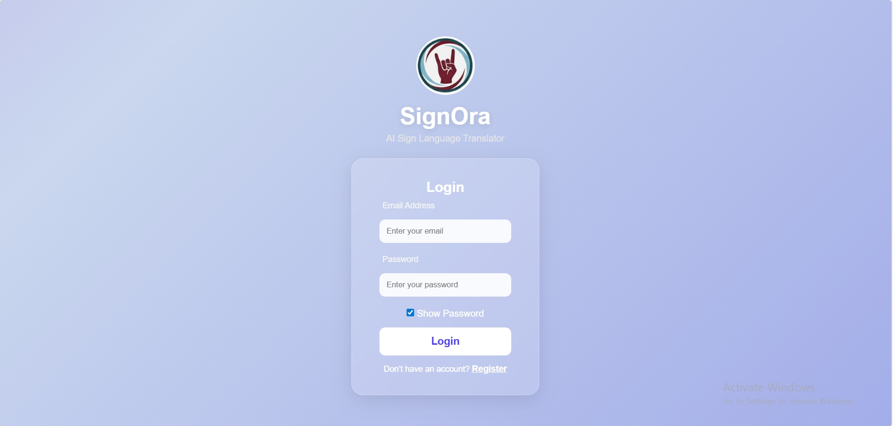
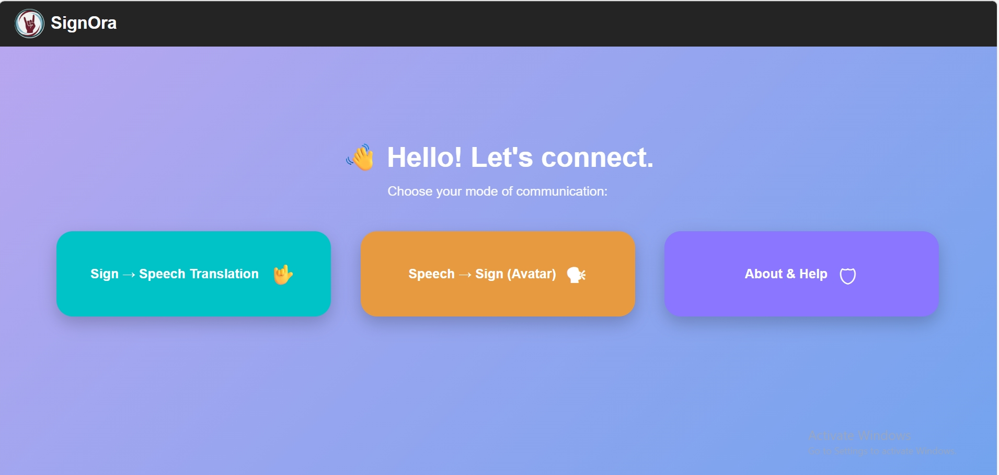
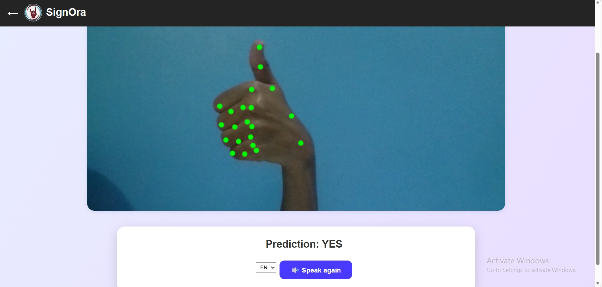
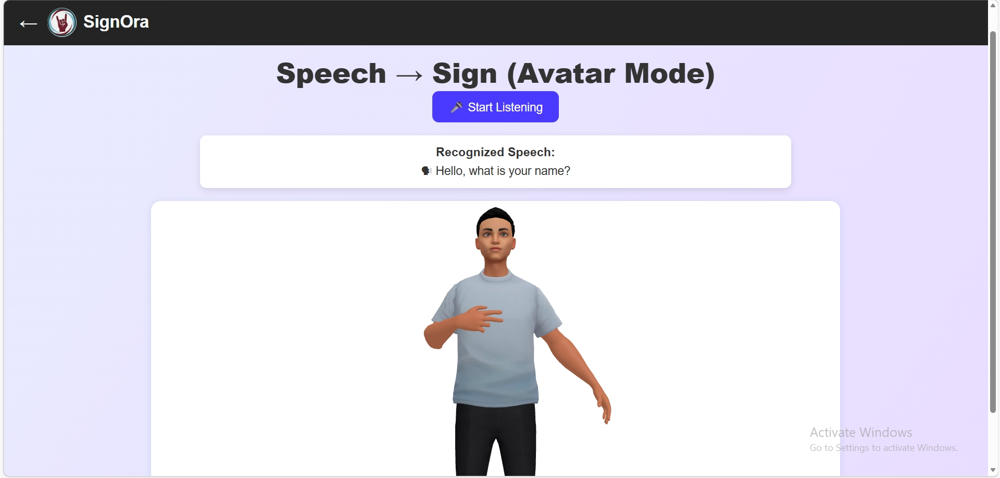
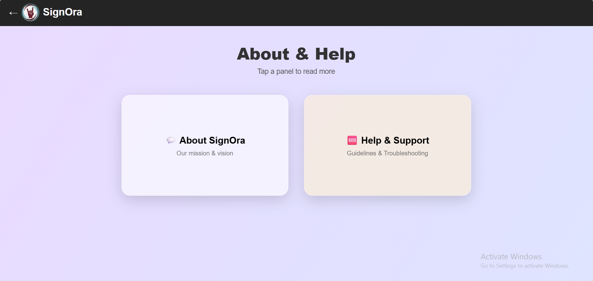

# 🤟 SignOra AI Translator

SignOra is an AI-powered accessibility system that enables communication between Deaf/Mute individuals and hearing people using gesture recognition and speech interaction.

---

## ✨ Features

✅ Sign → Speech translation  
✅ Speech → Sign avatar animation  
✅ Multilingual speech output  
✅ Intelligent sentence formation  
✅ Real-time gesture detection  

---

## 🛠 Tech Stack

- Python & Flask  
- MediaPipe & OpenCV  
- Scikit-learn  
- Blender  
- Three.js  
- HTML, CSS, JavaScript  

---

## 🤟 Sign → Speech Translation Flow

User shows hand gesture  
↓  
Camera captures hand  
↓  
MediaPipe detects hand landmarks  
↓  
Machine Learning model predicts sign  
↓  
Signs combined into words & sentences  
↓  
Sentence translated to selected language  
↓  
Prediction text displayed on screen  
↓  
Multilingual speech output generated  

---

## ✋ Supported Gestures (Current Version)

**I, HI, OKAY, NAME, YES, WATER, SORRY, YOU**

The system currently supports a core set of gestures optimized for real-time accuracy.  
The gesture vocabulary will be expanded in future versions.

---

## 🎙 Speech → Sign Translation Flow

User speaks into microphone  
↓  
Speech recognition converts voice to text  
↓  
Text mapped to sign gestures  
↓  
Text sent to avatar animation engine  
↓  
3D avatar performs corresponding sign animations  
↓  
User sees visual sign communication output  

---

## 📁 Project Structure
```
.
├── app.py                # Flask backend  
├── model.pkl             # trained ML model  
├── requirements.txt      # dependencies  

├── templates/            # HTML pages  
├── static/               # CSS, JS, images & assets  

├── train/                # model training scripts  
│   ├── train_model.py            # ✅ current one-hand gesture model  
│   ├── train_motion_one_hand.py  #  future enhancement (motion gestures)  
│   └── train_static_two_hand.py  #  future enhancement (two-hand signs)  

├── screenshots/          # images used in README
```
**Note:** The system currently uses the one-hand gesture model. Motion-based gestures and two-hand recognition are planned for future versions.


---

## 📸 Interface Preview

### 🔐 Login Page


### 🏠 Home Dashboard


### 🤟 Sign → Speech Translation


### 🎙 Speech → Sign Avatar Mode


### ℹ️ About & Help


## 🌐 Live Demo & Accessibility

SignOra is deployed and accessible online for real-time use.

👉 **Live Demo:** https://your-deployment-link.onrender.com  

You can try the system on:

✔ 📱 Mobile devices  
✔ 💻 Desktop & laptops  

For the best experience, use **Google Chrome** and allow camera and microphone permissions.

The interface is fully responsive and optimized for seamless accessibility.

## ⚙️ Installation & Setup

### Step 1: Clone Repository
```
git clone https://github.com/kotturuDivya04/signora-ai-translator.git
cd signora-ai-translator
```

### Step 2: Create Virtual Environment
**Windows**
```
python -m venv venv
venv\Scripts\activate
```

**Mac/Linux**
```
python3 -m venv venv
source venv/bin/activate
```

### Step 3: Install Dependencies
```
pip install -r requirements.txt
```
If MediaPipe installation fails:
```
pip install mediapipe opencv-python
```

### Step 4: Run Application
```
python app.py
```

### Step 5: Open in Browser
👉 http://127.0.0.1:10000/

### Step 6: Allow Permissions
✔ Allow Camera Access  
✔ Allow Microphone Access  

---
## 🚀 Future Enhancements

- Motion gesture recognition  
- Two-hand gesture support  
- Expanded gesture vocabulary  
- Multiple avatar styles & improved animations  
---
